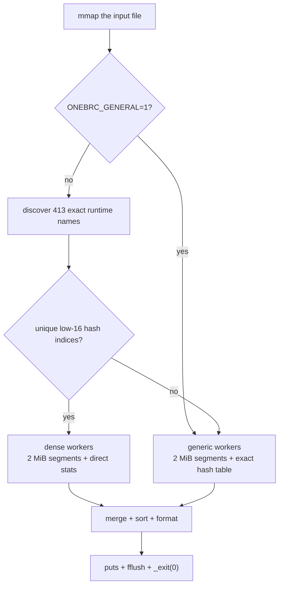

# 1brc-bosconia

An optimized C implementation of the
[One Billion Row Challenge](https://github.com/gunnarmorling/1brc) for
x86-64 Linux.

The tracked implementation is [`c/main.c`](c/main.c). It reads the official
one-billion-row dataset, aggregates minimum/mean/maximum temperature per
station, and writes the sorted result.

## Performance

The input files are produced by the official Java generator:
1,000,000,000 rows, 413 station names, and about 13.8 GB of UTF-8 text.
The implementation is validated byte-for-byte against the independent C
oracle in [`baseline/main.c`](baseline/main.c).

A published measurement belongs to one exact source revision, one host, and
one generated input file, and is republished when the tracked source changes.
No measurement is published for the current source yet.
[`docs/bench-artifacts.md`](docs/bench-artifacts.md) documents the metrics and
the preflight that produce a publishable measurement, and
[`scripts/bench.sh`](scripts/bench.sh) runs it.

## How it works



The canonical generator uses a fixed set of 413 names. At startup, the
program discovers those names from the input and verifies that their hash
values have unique low 16 bits. When that check passes, each worker initializes
a 65,536-entry table with minimum/maximum sentinels and directly updates
compact statistics:

```text
index = hash(name) & 65535
stats[index].update(temperature)
```

This removes per-row station-name comparisons and collision probing. Only 413
indices are visited during the final merge. Station names are not embedded in
the binary.

If a custom input ends before 413 names are found, or two names share a
low-16 index, the program uses its exact generic hash-table path. Set
`ONEBRC_GENERAL=1` to force that path for inputs with up to 16,384 distinct
names, and `ONEBRC_STRICT=1` to validate the whole input before any work
starts, rejecting out-of-contract records with exit `2`, empty output, and one
diagnostic. See [`docs/general-input.md`](docs/general-input.md).

The hot parser uses AVX2 to find `;`, branchless fixed-point temperature
parsing, two independent parsing lanes, bucket prefetching, 2 MiB
work-stealing segments, and one private table per worker. See
[`docs/algorithm.md`](docs/algorithm.md) for the implementation walkthrough.

## Build

Install the C toolchain and benchmark utilities:

```bash
sudo apt-get install -y build-essential hyperfine util-linux
```

The optimized program requires x86-64 with AVX2 and BMI2.

```bash
./scripts/build.sh
```

The build creates two local executable files:

- `c/c-linux` — optimized implementation;
- `baseline/baseline` — simple correctness oracle.

These are generated build outputs and are intentionally excluded from Git, so
they do not appear in the repository browser.

## Verify

```bash
./verify.sh
```

One command runs every correctness surface that does not need the dataset:
the oracle smoke test, byte-exact dense/fallback/temperature/EOF fixtures, the
deterministic parser and guard-page sanitizer corpus, the general-input
cardinality tests, the strict-input and runtime-envelope tests, and the
repository contract checks.

It needs no root privileges, no network access, and no generated dataset. It
writes only inside `.test-work/`, removes that directory, and fails if the run
changed the working tree. It is budgeted to finish in under five minutes on a
modern desktop or CI runner. The same command runs in continuous integration
for every pull request and every push to `main`.

See [`docs/verification.md`](docs/verification.md).

## Validate against the full dataset

```bash
./scripts/validate.sh measurements_1B.txt
```

Validation runs `./verify.sh` first and then adds the one check that needs
data: the optimized output compared byte-for-byte with the oracle over a
complete dataset.

## Generate the official dataset

Dataset generation requires Git, JDK 21, and about 14 GB of free disk space.
The script uses the upstream repository's Maven wrapper.

```bash
sudo apt-get install -y git openjdk-21-jdk-headless
./scripts/gen-data.sh measurements_1B.txt
```

## Benchmark

Prepare the host after each reboot:

```bash
sudo ./scripts/setup-quiet.sh
```

Then run:

```bash
./scripts/bench.sh measurements_1B.txt
```

The benchmark script validates the result, warms the file sequentially with
`dd`, reports page residency with `fincore`, and times the generated optimized
executable with Hyperfine.

## Repository layout

```text
verify.sh             dataset-independent verification gate
c/
  main.c              optimized implementation
  Makefile
baseline/
  main.c              independent correctness oracle
  Makefile
scripts/              build, validate, benchmark, host setup, data generation
tests/                fixtures, parser/EOF corpus, sanitizer, strict-input,
                      cardinality, and repository-contract tests
docs/
  algorithm.md          implementation walkthrough
  bench-artifacts.md    benchmark methodology and measurements
  general-input.md      exact supported input, strict mode, cardinality modes
  parser-fuzz-corpus.md deterministic corpus and input contract
  verification.md       what ./verify.sh runs and what CI enforces
.github/workflows/    continuous integration
```

## License

MIT.
