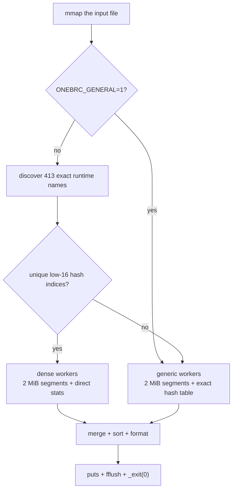

# 1brc-bosconia

An optimized C implementation of the
[One Billion Row Challenge](https://github.com/gunnarmorling/1brc) for
x86-64 Linux.

The tracked implementation is [`c/main.c`](c/main.c). It reads the official
one-billion-row dataset, aggregates minimum/mean/maximum temperature per
station, and writes the sorted result.

## Performance

The input files were produced by the official Java generator:
1,000,000,000 rows, 413 station names, and about 13.8 GB of UTF-8 text.
The implementation is validated byte-for-byte against the independent C
oracle in [`baseline/main.c`](baseline/main.c).

### Ryzen 7 1700

Measured 2026-08-21 on an 8-core / 16-thread AMD Ryzen 7 1700 with 32 GiB
DDR4-2667, Ubuntu 26.04, kernel 7.0.0-15, and gcc 15.2.0.

| Mean elapsed | Std. dev. | Fastest | Mean CPU time |
|---:|---:|---:|---:|
| **635.7 ms** | 6.5 ms | 628.8 ms | 9,918 ms |

The table summarizes 20 executions after five warmups.

### Azure Standard_F16as_v6

Measured 2026-08-21 on an AMD EPYC 9V74 VM with 16 physical Zen 4 cores,
62 GiB RAM, Ubuntu 24.04, Azure kernel 6.17, and gcc 13.3.0.

| Mean elapsed | Std. dev. | Fastest | Mean CPU time |
|---:|---:|---:|---:|
| **265.5 ms** | 0.4 ms | 264.9 ms | 4,118 ms |

The table summarizes 20 executions after five warmups.

Each table describes its own host and independently generated input file.
Full methodology and hashes are in
[`docs/bench-artifacts.md`](docs/bench-artifacts.md).

## How it works



The canonical generator uses a fixed set of 413 names. At startup, the
program discovers those names from the input and verifies that their hash
values have unique low 16 bits. When that check passes, each worker initializes
a 65,536-entry table with minimum/maximum sentinels and directly updates
compact statistics:

```text
index = hash(name) & 65535
stats[index].update(temperature)
```

This removes per-row station-name comparisons and collision probing. Only 413
indices are visited during the final merge. Station names are not embedded in
the binary.

If a custom input ends before 413 names are found, or two names share a
low-16 index, the program uses its exact generic hash-table path. Set
`ONEBRC_GENERAL=1` to force that path for inputs with up to 16,384 distinct
names. See [`docs/general-input.md`](docs/general-input.md).

The hot parser uses AVX2 to find `;`, branchless fixed-point temperature
parsing, two independent parsing lanes, bucket prefetching, 2 MiB
work-stealing segments, and one private table per worker. See
[`docs/algorithm.md`](docs/algorithm.md) for the implementation walkthrough.

## Build

Install the C toolchain and benchmark utilities:

```bash
sudo apt-get install -y build-essential hyperfine util-linux
```

The optimized program requires x86-64 with AVX2 and BMI2.

```bash
./scripts/build.sh
```

The build creates two local executable files:

- `c/c-linux` — optimized implementation;
- `baseline/baseline` — simple correctness oracle.

These are generated build outputs and are intentionally excluded from Git, so
they do not appear in the repository browser.

## Validate

```bash
./scripts/validate.sh measurements_1B.txt
```

Validation compares the optimized output byte-for-byte with the oracle. It
also runs dense-mode, collision-fallback, exhaustive-temperature, sanitizer,
long-name, page-aligned EOF, and general-input/cardinality regressions.

## Generate the official dataset

Dataset generation requires Git, JDK 21, and about 14 GB of free disk space.
The script uses the upstream repository's Maven wrapper.

```bash
sudo apt-get install -y git openjdk-21-jdk-headless
./scripts/gen-data.sh measurements_1B.txt
```

## Benchmark

Prepare the host after each reboot:

```bash
sudo ./scripts/setup-quiet.sh
```

Then run:

```bash
./scripts/bench.sh measurements_1B.txt
```

The benchmark script validates the result, warms the file sequentially with
`dd`, reports page residency with `fincore`, and times the generated optimized
executable with Hyperfine.

## Repository layout

```text
c/
  main.c              optimized implementation
  Makefile
baseline/
  main.c              independent correctness oracle
  Makefile
scripts/              build, validate, benchmark, host setup, data generation
tests/                dense, fallback, parser, sanitizer, and EOF regressions
docs/
  algorithm.md        implementation walkthrough
  bench-artifacts.md  benchmark methodology and measurements
  general-input.md    exact supported input and cardinality modes
```

## License

MIT.
